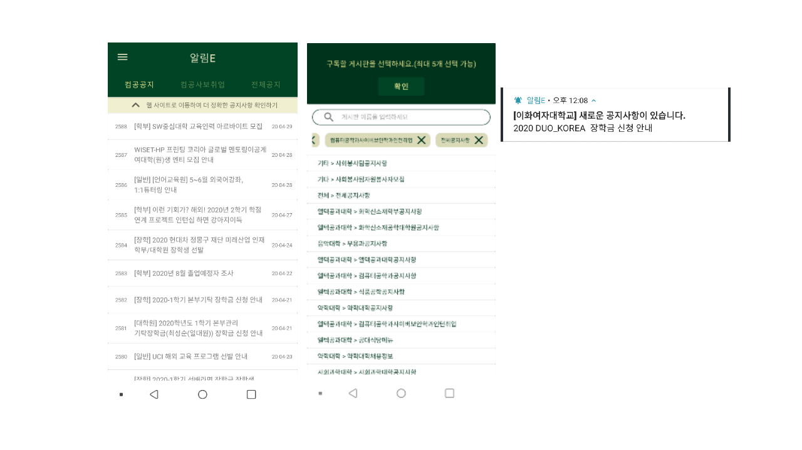

# 알림E



이화여자대학교 게시판에 게시되는 게시물을 편하게 모아서 확인할 수 있습니다.<br>
현재 교내 120개 이상의 개별 게시판에 대한 기능을 제공합니다.<br>
구독한 게시판에 새로운 공지사항이 게시된 경우, 실시간으로 알림을 받아볼 수 있습니다.

<a href='https://play.google.com/store/apps/details?id=com.ake.ewhanoticeclient&pcampaignid=pcampaignidMKT-Other-global-all-co-prtnr-py-PartBadge-Mar2515-1'>
</a>


## Other

Server  https://github.com/Jo-Yewon/EwhaNoticeServer


## Dependencies
```
    // Androidx
    implementation 'androidx.appcompat:appcompat:1.1.0'
    implementation 'androidx.core:core-ktx:1.2.0'
    implementation 'androidx.constraintlayout:constraintlayout:1.1.3'
    implementation 'androidx.recyclerview:recyclerview:1.1.0'
    implementation 'com.google.android.material:material:1.1.0'
    implementation "androidx.swiperefreshlayout:swiperefreshlayout:1.0.0"
    implementation "androidx.viewpager2:viewpager2:1.0.0"
    implementation 'androidx.preference:preference:1.1.0'
    implementation 'androidx.legacy:legacy-support-v4:1.0.0'

    // Testing
    testImplementation 'junit:junit:4.13'
    testImplementation "androidx.room:room-testing:$room_version"
    androidTestImplementation 'androidx.test.ext:junit:1.1.1'
    androidTestImplementation 'androidx.test.espresso:espresso-core:3.2.0'
    androidTestImplementation "org.jetbrains.kotlin:kotlin-test-junit:$kotlin_version"
    androidTestImplementation "androidx.arch.core:core-testing:2.0.0"
    testImplementation 'org.mockito:mockito-core:2.19.0'
    testImplementation 'org.powermock:powermock-module-junit4:2.0.4'
    testImplementation 'org.powermock:powermock-api-mockito2:2.0.4'

    // Firebase
    implementation 'com.google.firebase:firebase-messaging:20.1.0'
    implementation 'com.google.firebase:firebase-core:16.0.4'

    // lifecycle
    implementation "androidx.lifecycle:lifecycle-extensions:${lifecycle_version}"
    implementation "androidx.lifecycle:lifecycle-viewmodel-ktx:${lifecycle_version}"

    //retrofit
    implementation "com.squareup.retrofit2:retrofit:${retrofit_version}"
    implementation "com.squareup.retrofit2:converter-gson:${retrofit_version}"
    implementation 'com.squareup.okhttp3:logging-interceptor:4.3.1'

    //Room
    implementation "androidx.room:room-runtime:$room_version"
    kapt "androidx.room:room-compiler:$room_version"

    //Coroutine
    implementation "org.jetbrains.kotlinx:kotlinx-coroutines-core:$coroutine_version"
    implementation "org.jetbrains.kotlinx:kotlinx-coroutines-android:$coroutine_version"

    //Paging
    implementation "androidx.paging:paging-runtime:$paging_version"

    //Chrome Custom tab
    implementation 'androidx.browser:browser:1.2.0'
```
